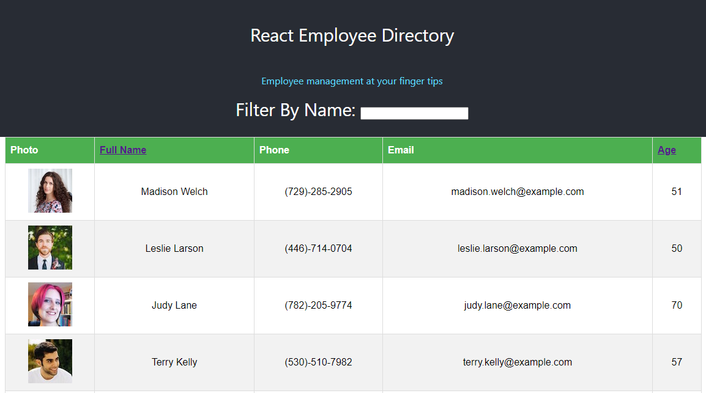

# Employee Directory

[Deployed Site](https://employeedirectoryreactjs.herokuapp.com/)
  

## Description

An employee directory that utilizes React to update information

## Table of Contents
  
*  [Usage](#usage)

*  [Contributing](#contributing)

*  [Support](#support)

*  [License](#license)

## Usage

Employee information is displayed in a table format through React components to dynamically display each employee. Clicking on the name column sorts the employees alphabetically. Clicking the name column again sorts in reverse. An employee can be searched by first or last name by typing in the input field.

## Contributing

No contributions are currently being accepted for this project.

## Support

For support regarding this project please contact me via GitHub

## License

This project is licensed under the MIT License.
